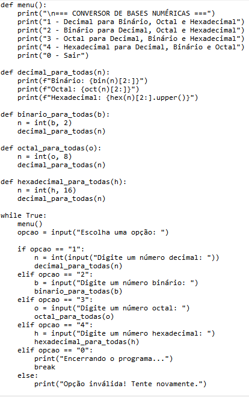

  <p align="center">
  <a href="https://sejaunibras.com.br"></a>
</p>

---

## 📌 Título do Projeto

> Certificado Curso [Computer Hardware Basics - Cisco](https://www.netacad.com/courses/computer-hardware-basics?courseLang=en-US)

---

## 👥 Equipe de Autores e Participantes

### 👥 Aluno

* [Luiz Henrique Martins Barbosa]

### 👔 Docentes e Orientação

* **Orientador(a):** [FRANCISMAR ALVES MARTINS JUNIOR](https://www.linkedin.com/in/francismar-alves-martins-junior-8a320b90/)
* **Coordenador(a):** [GUILHERME NOGUEIRA](#)

### 📄 Identificação

* Disciplina: Arquitetura e Organização de Computadores
* Professor(a): [FRANCISMAR ALVES MARTINS JUNIOR](https://www.linkedin.com/in/francismar-alves-martins-junior-8a320b90/)

### 🎯 Tema e Contextualização

> O curso oferece uma introdução ao hardware de PC's e dipositivos móveis, seus componentes internos, como funcionam e como sulionar problemas.

### 🛠️ Estrutura do Repositório

```python
templatesUNIBRAS/
├─ assets/
│  └─ (imagens, logotipos e recursos visuais para o README e templates)
├─ document/
│  └─ (modelos de documentos em .docx, .pdf ou .md para diferentes usos)
├─ src/
│  └─ (código fonte de exemplos, scripts de automação ou templates LaTeX, se existirem)
├─ .gitattributes
├─ .gitignore
├─ LICENSE
├─ README.md
 ```
 
### 📷 Evidências Visuais




## 📋 Licença e Atribuições


[Modelo GIT UNIBRAS](https://github.com/yggdrasilGit/templatesUNIBRAS) por [UNIBRAS](https://sejaunibras.com.br) está licenciado sob [CC BY 4.0 International](http://creativecommons.org/licenses/by/4.0/?ref=chooser-v1).